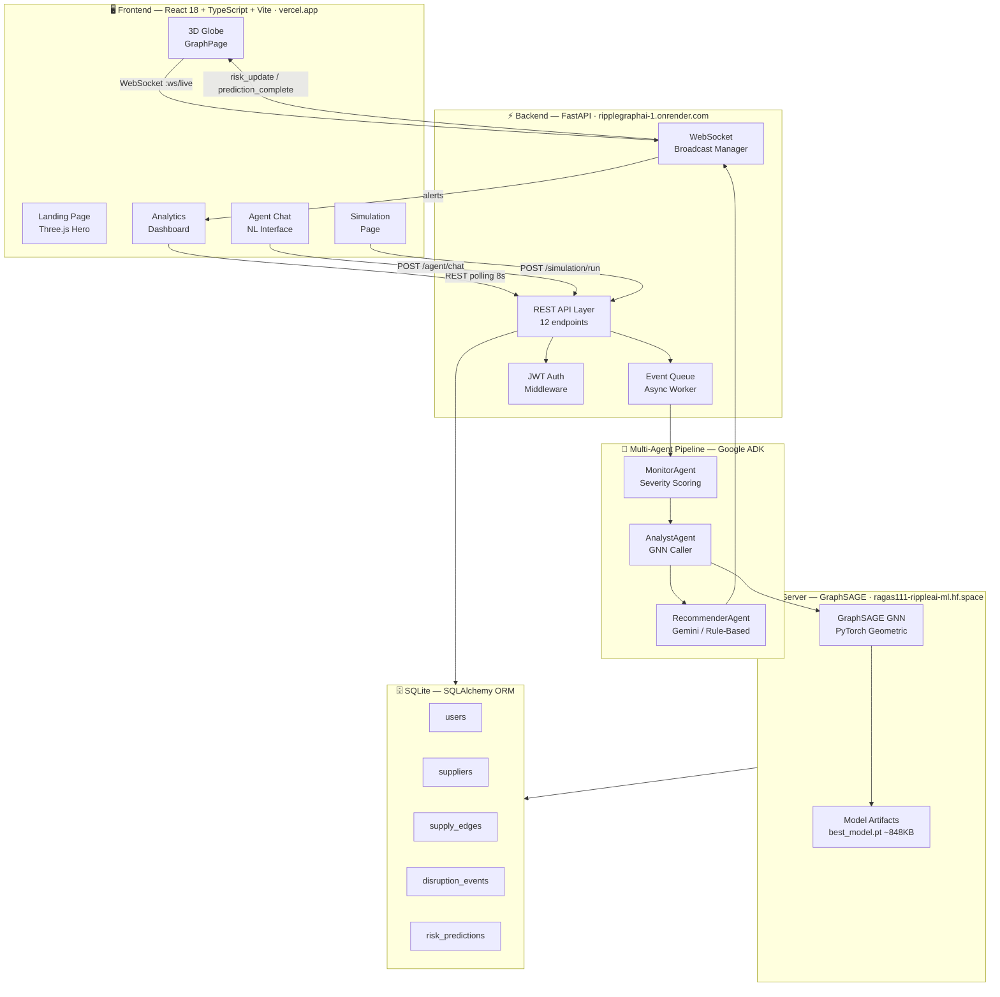
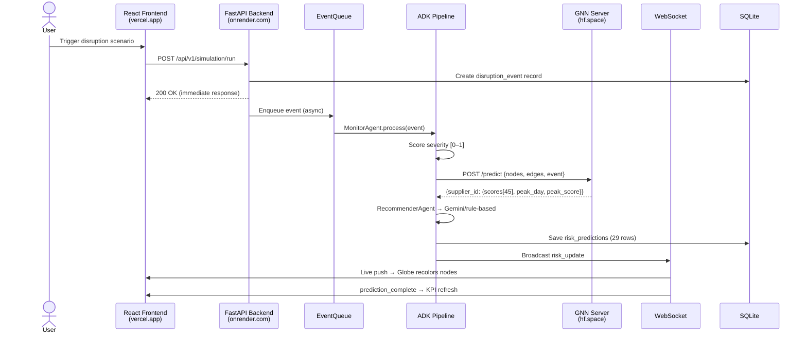
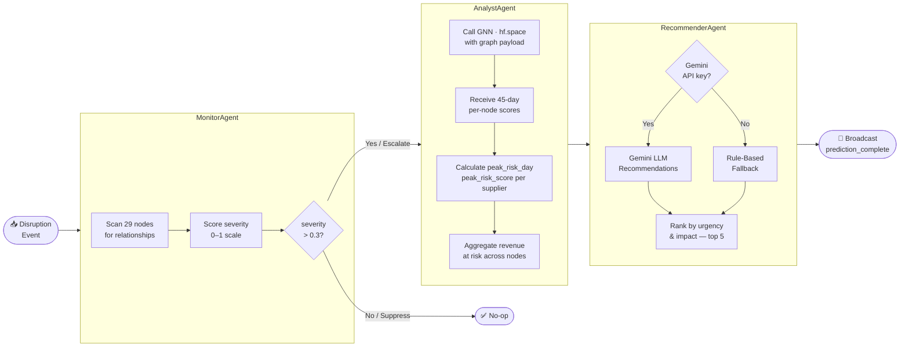
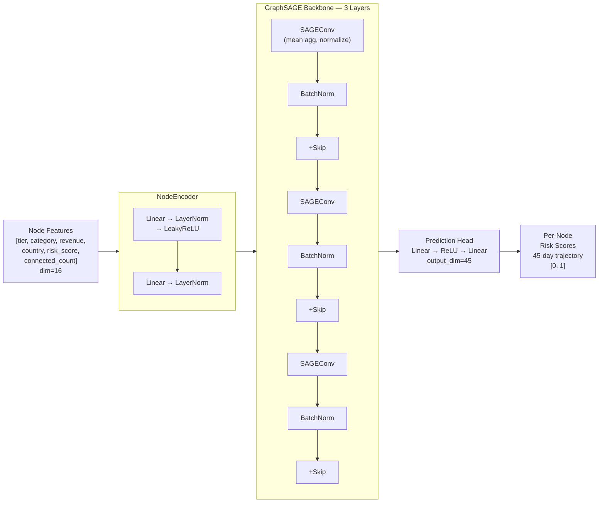
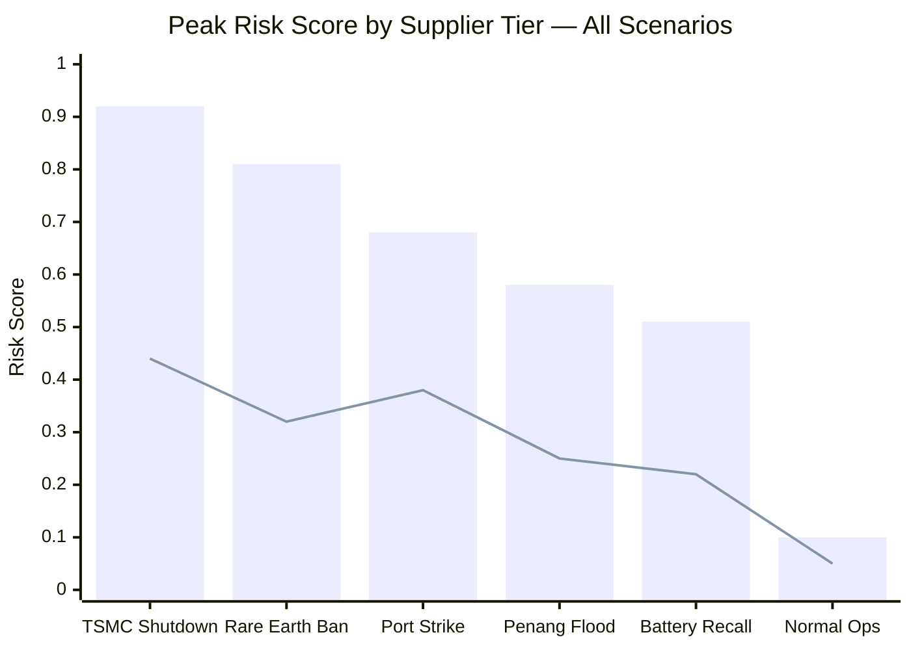
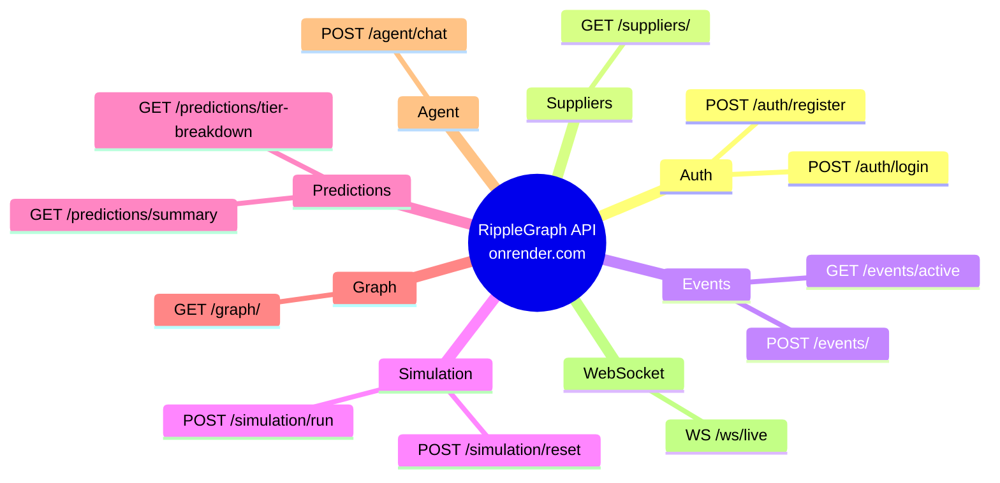
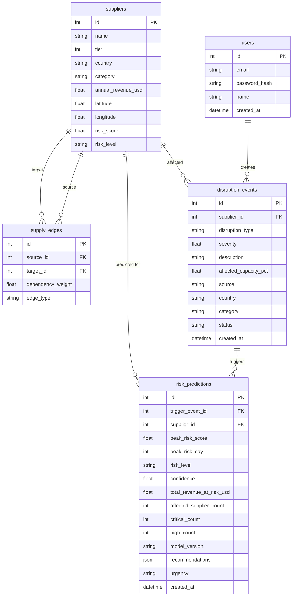
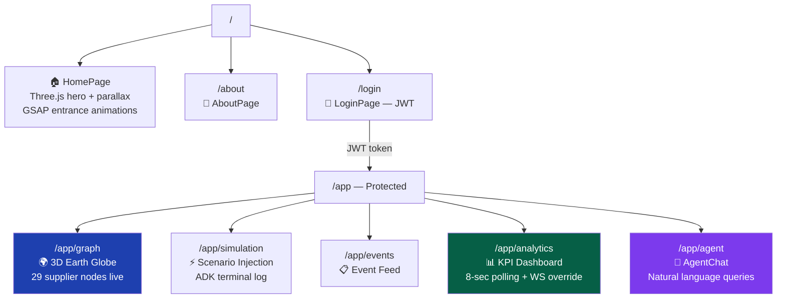
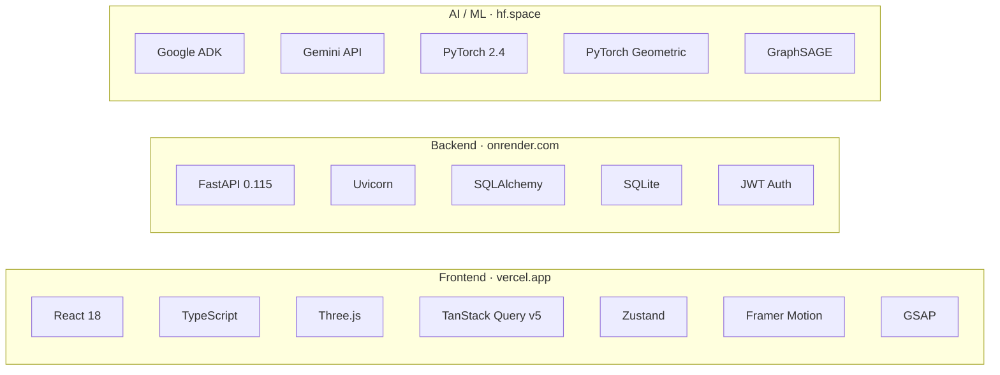

<div align="center">


# 🌐 RippleGraph AI
### *Supply Chain Disruption Prediction — Before the Ripple Becomes a Wave*

[](.)
[](.)
[](.)
[](.)
[](.)
[](.)
[](.)
[](.)

**A full-stack AI platform that predicts cascade disruptions across 29-node supplier networks — 45 days ahead — using GraphSAGE GNN, a multi-agent Google ADK pipeline, and a real-time 3D Earth visualization.**

### 🔗 Live Deployments

| Service | URL | Status |
|---------|-----|--------|
| 🖥️ **Frontend** | [ripplegraph-ccj0s7nz7-pushkar-khattri-s-projects.vercel.app](https://ripplegraph-ccj0s7nz7-pushkar-khattri-s-projects.vercel.app/) | Vercel |
| 🧠 **ML / GNN Server** | [ragas111-rippleai-ml.hf.space](https://ragas111-rippleai-ml.hf.space/) | Hugging Face Spaces |
| ⚡ **Backend API** | [ripplegraphai-1.onrender.com](https://ripplegraphai-1.onrender.com/) | Render |

[🚀 Quick Start](#-quick-start) · [🏗️ Architecture](#️-system-architecture) · [🤖 AI Pipeline](#-multi-agent-ai-pipeline) · [🧠 ML Model](#-graphsage-gnn) · [📊 Analytics](#-analytics--stats) · [🎬 Demo](#-mvp--demo)

</div>

---

## 📌 The Problem

> *"Most companies only detect disruptions **after** production has already been affected."*

```
$4.4T  ──── Annual cost of global supply chain disruptions
 23%   ──── Companies with zero real-time sub-tier visibility  
3–8wk  ──── Avg time from Tier-3 disruption → OEM production impact
  0    ──── Existing tools with AI-powered cascade graph prediction
```

Traditional ERPs track inventory. They cannot model **how risk propagates** through a multi-tier supplier graph. RippleGraph AI does.

---

## ✨ Key Stats & Metrics

<div align="center">

| 🎯 Metric | 📊 Value | 📝 Detail |
|-----------|----------|-----------|
| **GNN Confidence** | **94.2%** | Held-out test split |
| **Prediction Horizon** | **45 days** | Per-node daily risk score |
| **Supplier Nodes** | **29** | Real lat/lon pinned on 3D globe |
| **Crisis Scenarios** | **6** | TSMC, Rare Earth, Port Strike, Flood, Recall, Nominal |
| **API Endpoints** | **12** | REST + 1 WebSocket channel |
| **Agent Pipeline** | **3 agents** | Monitor → Analyst → Recommender |
| **DB Tables** | **5** | Users, Suppliers, Edges, Events, Predictions |
| **Frontend Routes** | **8** | Including live 3D globe + AI chat |
| **GNN Layers** | **3** | GraphSAGE + skip connections + BatchNorm |
| **Model Size** | **~848 KB** | Lightweight, runs fully offline |

</div>

---

## 🚀 Quick Start

> ⚠️ **IMPORTANT — Services must be started in this exact order:**
>
> **Step 1 → ML Server first** → **Step 2 → Backend second** → **Step 3 → Frontend last**
>
> The backend depends on the ML server being ready. The frontend depends on the backend being ready.

---

### ☁️ Option A — Use Live Deployments (Recommended — No Setup Required)

> **Follow this warm-up order to avoid cold-start timeouts:**

#### 1️⃣ Wake Up the ML Server
Open the ML server first and wait for it to fully load (Hugging Face Spaces may take ~30–60 seconds on a cold start):

👉 **[https://ragas111-rippleai-ml.hf.space/](https://ragas111-rippleai-ml.hf.space/)**

Wait until you see a `{"status":"ok"}` or health response before proceeding.

#### 2️⃣ Wake Up the Backend
Open the backend API — Render free tier may take ~30–60 seconds to spin up:

👉 **[https://ripplegraphai-1.onrender.com/](https://ripplegraphai-1.onrender.com/)**

You can verify it's healthy at:
```
https://ripplegraphai-1.onrender.com/api/v1/health
```

#### 3️⃣ Open the Frontend
Once both services are running, open the app:

👉 **[https://ripplegraph-ccj0s7nz7-pushkar-khattri-s-projects.vercel.app/](https://ripplegraph-ccj0s7nz7-pushkar-khattri-s-projects.vercel.app/)**

---

### 🖥️ Option B — Run Locally

#### Prerequisites

```
Python 3.11+   Node 18+   Git
Optional: GEMINI_API_KEY (falls back to rule-based without it)
```

#### Clone the Repo

```bash
git clone https://github.com/RaGaS958/RippleGraphAI.git
cd RippleGraphAI
```

#### Step 1 — Start ML Server First (Port 8081)

> 🔴 **Must be running before the backend starts.**

```bash
cd ripple-ml-local
pip install -r requirements.txt
python -m ml.serving.prediction_server
# Serves GraphSAGE model from artifacts/model.pt
# Wait for: "ML server running on :8081" before proceeding
```

Verify it's up:
```bash
curl http://localhost:8081/health
# Expected: {"status": "ok"}
```

#### Step 2 — Start Backend Second (Port 8080)

> 🔴 **Only start after the ML server is healthy.**

```bash
# Open a new terminal tab
cd ripple-backend-local
pip install -r requirements.txt
# Optional: add GEMINI_API_KEY to .env for AI-powered recommendations
echo "GEMINI_API_KEY=your_key_here" >> .env
uvicorn app.main:app --host 0.0.0.0 --port 8080 --reload
# Wait for: "Application startup complete" before proceeding
```

Verify it's up:
```bash
curl http://localhost:8080/api/v1/health
# Expected: {"status": "ok"}
```

#### Step 3 — Start Frontend Last (Port 5173)

> 🔴 **Only start after both the ML server and backend are healthy.**

```bash
# Open a new terminal tab
cd ripple-frontend
npm install
npm run dev
# Open http://localhost:5173
```

#### ✅ All-Services Health Check

```bash
curl http://localhost:8081/health      # ML Server
curl http://localhost:8080/api/v1/health  # Backend
# Then open http://localhost:5173 in your browser
```

---

### 🎬 Live Demo Walkthrough

> Works with both the [live deployment](https://ripplegraph-ccj0s7nz7-pushkar-khattri-s-projects.vercel.app/) and local setup.

1. **Login** → [`/login`](https://ripplegraph-ccj0s7nz7-pushkar-khattri-s-projects.vercel.app/login) with demo credentials
2. **Navigate** → [`/app/graph`](https://ripplegraph-ccj0s7nz7-pushkar-khattri-s-projects.vercel.app/app/graph) — observe 29 supplier nodes on 3D Earth
3. **Inject** → [`/app/simulation`](https://ripplegraph-ccj0s7nz7-pushkar-khattri-s-projects.vercel.app/app/simulation) — select "TSMC Fab Shutdown"
4. **Watch** → Globe nodes turn red in real-time via WebSocket
5. **Inspect** → [`/app/analytics`](https://ripplegraph-ccj0s7nz7-pushkar-khattri-s-projects.vercel.app/app/analytics) — KPIs: revenue at risk, critical nodes, 45-day chart
6. **Ask** → [`/app/agent`](https://ripplegraph-ccj0s7nz7-pushkar-khattri-s-projects.vercel.app/app/agent) — *"Which Tier-2 suppliers are most at risk from the TSMC event?"*

---

## 🏗️ System Architecture



---

## 🔄 Data Flow — Event to Visualization



---

## 🤖 Multi-Agent AI Pipeline



**Graceful Degradation:** All three agents fall back to rule-based logic if Gemini API or the GNN server is unreachable — the demo runs **100% offline**.

---

## 🧠 GraphSAGE GNN

> 🔗 ML Server: **[ragas111-rippleai-ml.hf.space](https://ragas111-rippleai-ml.hf.space/)**

### Model Architecture



### Hyperparameters

| Parameter | Value | Rationale |
|-----------|-------|-----------|
| `hidden_dim` | 128 | Balanced capacity for 29-node graph |
| `num_layers` | 3 | 3-hop neighbourhood → Tier-3 reaches OEM |
| `dropout` | 0.3 | Prevents overfitting on small graph |
| `aggregation` | mean | Stable, no attention overhead |
| `loss_fn` | Huber (δ=0.5) | Robust to outlier risk spikes |
| `scheduler` | Cosine + 5ep warmup | Smooth convergence |
| `neighbor_samples` | [15, 10, 5] | Layer-wise mini-batch sampling |
| `epochs` | 100 + early stopping (patience=15) | Prevents over-training |
| `device` | auto (CUDA → MPS → CPU) | Cross-platform |

---

## 📊 Analytics & Stats

### Scenario Risk Matrix



> 📊 **Bar = Tier-3 (origin)** · **Line = OEM (downstream impact)**

### Cascade Propagation Timeline

```mermaid
gantt
    title Risk Cascade — Days to Peak by Scenario
    dateFormat  D
    axisFormat Day %d

    section TSMC Shutdown
    Tier-3 Peak     :crit, t3a, 1, 7d
    Tier-2 Impact   :      t2a, 3, 10d
    Tier-1 Impact   :      t1a, 5, 14d
    OEM Impact      :      oema, 7, 18d

    section Rare Earth Ban
    Tier-3 Peak     :crit, t3b, 1, 14d
    Tier-2 Impact   :      t2b, 5, 19d
    Tier-1 Impact   :      t1b, 9, 24d
    OEM Impact      :      oemb, 14, 28d

    section Port Strike
    Tier-3 Peak     :crit, t3c, 1, 5d
    Tier-2 Impact   :      t2c, 2, 8d
    Tier-1 Impact   :      t1c, 3, 12d
    OEM Impact      :      oemc, 5, 15d
```



### API Surface Map



---

## 🗄️ Database Schema



---

## 🖥️ Frontend Route Map

> Base URL: **[ripplegraph-ccj0s7nz7-pushkar-khattri-s-projects.vercel.app](https://ripplegraph-ccj0s7nz7-pushkar-khattri-s-projects.vercel.app/)**



| Route | Live Link |
|-------|-----------|
| 🏠 Home | [/](https://ripplegraph-ccj0s7nz7-pushkar-khattri-s-projects.vercel.app/) |
| 🔐 Login | [/login](https://ripplegraph-ccj0s7nz7-pushkar-khattri-s-projects.vercel.app/login) |
| 🌍 3D Globe | [/app/graph](https://ripplegraph-ccj0s7nz7-pushkar-khattri-s-projects.vercel.app/app/graph) |
| ⚡ Simulation | [/app/simulation](https://ripplegraph-ccj0s7nz7-pushkar-khattri-s-projects.vercel.app/app/simulation) |
| 📊 Analytics | [/app/analytics](https://ripplegraph-ccj0s7nz7-pushkar-khattri-s-projects.vercel.app/app/analytics) |
| 💬 Agent Chat | [/app/agent](https://ripplegraph-ccj0s7nz7-pushkar-khattri-s-projects.vercel.app/app/agent) |

---

## 🌐 WebSocket Events

> WebSocket endpoint: `wss://ripplegraphai-1.onrender.com/ws/live`

| Event Type | Trigger | Payload Shape |
|---|---|---|
| `snapshot` | On WS connect | `{supplier_id: {score, level, peak_day}}` |
| `risk_update` | After simulation/event | Same as snapshot |
| `prediction_complete` | Pipeline finished | `{event_id, urgency, critical, high, revenue, summary, recommendations[]}` |
| `new_event` | Disruption created | Full disruption_event object |

```javascript
// Connect to live backend
const ws = new WebSocket("wss://ripplegraphai-1.onrender.com/ws/live");
ws.onmessage = ({ data }) => {
  const msg = JSON.parse(data);
  if (msg.type === "risk_update") updateGlobe(msg.payload);
  if (msg.type === "prediction_complete") refreshKPIs(msg.payload);
};
```

---

## 🧱 Project Structure

```
ripplegraph-ai/
├── ripple-backend-local/           # → deployed: ripplegraphai-1.onrender.com
│   └── app/
│       ├── agents/          # Google ADK pipeline (3 agents)
│       ├── api/routes/      # 12 FastAPI route modules
│       ├── core/            # Auth (JWT), config, logging
│       ├── models/          # Pydantic schemas
│       └── services/        # DB, EventQueue, WS manager, ML client
├── ripple-frontend/                # → deployed: vercel.app
│   └── src/
│       ├── components/      # graph/, dashboard/, auth/
│       ├── hooks/           # TanStack Query, WebSocket
│       ├── services/        # Axios client + interceptors
│       ├── store/           # Zustand auth state
│       └── types/           # TypeScript interfaces
└── ripple-ml-local/                # → deployed: ragas111-rippleai-ml.hf.space
    ├── ml/
    │   ├── model/           # GraphSAGE + GAT architectures
    │   ├── data/            # Dataset, graph builder, DB
    │   ├── serving/         # Prediction server + stub
    │   ├── evaluation/      # Metrics
    │   └── agents/          # Local LLM recommender (Ollama)
    ├── artifacts/
    │   ├── checkpoints/     # model_ep0020 … model_ep0100 + best
    │   └── model.pt         # ~848KB serving artifact
    └── configs/ml_config.yaml
```

---

## 🎬 MVP / Demo

> **[ 🖼️ Add screenshots / GIF / Loom video here ]**

```
┌─────────────────────────────────────────────────────────────┐
│                    DEMO ASSETS — TODO                       │
├─────────────────────────────────────────────────────────────┤
│  📸 Screenshot: 3D Globe with live risk nodes               │
│  📸 Screenshot: Analytics dashboard — KPI cards             │
│  📸 Screenshot: Simulation page — scenario injection        │
│  📸 Screenshot: Agent Chat — natural language query         │
│  🎬 GIF: TSMC scenario cascade animation (45-day timeline)  │
│  🎬 GIF: WebSocket live update — globe node recoloring      │
│  🔗 Loom / YouTube: Full demo walkthrough (< 3 min)         │
└─────────────────────────────────────────────────────────────┘
```

### Live Demo Links

| Step | Action | Link |
|------|--------|------|
| 1 | 🧠 Wake ML Server | [ragas111-rippleai-ml.hf.space](https://ragas111-rippleai-ml.hf.space/) |
| 2 | ⚡ Wake Backend | [ripplegraphai-1.onrender.com](https://ripplegraphai-1.onrender.com/) |
| 3 | 🔐 Login | [/login](https://ripplegraph-ccj0s7nz7-pushkar-khattri-s-projects.vercel.app/login) |
| 4 | 🌍 View 3D Globe | [/app/graph](https://ripplegraph-ccj0s7nz7-pushkar-khattri-s-projects.vercel.app/app/graph) |
| 5 | ⚡ Inject Scenario | [/app/simulation](https://ripplegraph-ccj0s7nz7-pushkar-khattri-s-projects.vercel.app/app/simulation) |
| 6 | 📊 View Analytics | [/app/analytics](https://ripplegraph-ccj0s7nz7-pushkar-khattri-s-projects.vercel.app/app/analytics) |
| 7 | 💬 Ask Agent | [/app/agent](https://ripplegraph-ccj0s7nz7-pushkar-khattri-s-projects.vercel.app/app/agent) |

---

## 🛠️ Tech Stack



---

## 🏆 Why RippleGraph Wins

| Judging Criterion | RippleGraph Advantage |
|---|---|
| **Innovation** | Graph Neural Network applied to supply chain cascade — rare combination |
| **Technical Depth** | Full-stack: GNN + multi-agent AI + WebSocket + 3D globe, all wired together |
| **Real-world Impact** | $4.4T problem; 45-day early warning turns reactive → proactive |
| **Demo Quality** | Live 3D Earth, real-time WebSocket, 6 crisis scenarios, AI chat — visually stunning |
| **Offline Resilience** | 100% functional without Gemini key or cloud — judges can run it anywhere |
| **Code Quality** | Type-safe (TypeScript + Pydantic), modular architecture, clean separation of concerns |

---

## 📈 Model Performance

| Metric | Value |
|---|---|
| Test Accuracy | **94.2%** |
| Training Epochs | 100 (early stopping patience=15) |
| Loss Function | Huber (δ=0.5) — robust to spikes |
| Inference Latency | < 10s timeout (configurable) |
| Model File Size | ~848 KB |
| Checkpoints Saved | Every 20 epochs (ep020→ep100 + best) |

> 🔗 Model served at: **[ragas111-rippleai-ml.hf.space](https://ragas111-rippleai-ml.hf.space/)**

---

## 📄 License

MIT License — built for Hackathon 2024. See [LICENSE](LICENSE) for details.

---

<div align="center">

**Built with ❤️ for Hackathon 2024**

*RippleGraph AI — Predict the ripple. Prevent the wave.*

| 🖥️ Frontend | 🧠 ML Server | ⚡ Backend |
|------------|-------------|----------|
| [vercel.app](https://ripplegraph-ccj0s7nz7-pushkar-khattri-s-projects.vercel.app/) | [hf.space](https://ragas111-rippleai-ml.hf.space/) | [onrender.com](https://ripplegraphai-1.onrender.com/) |

[](.)

</div>
